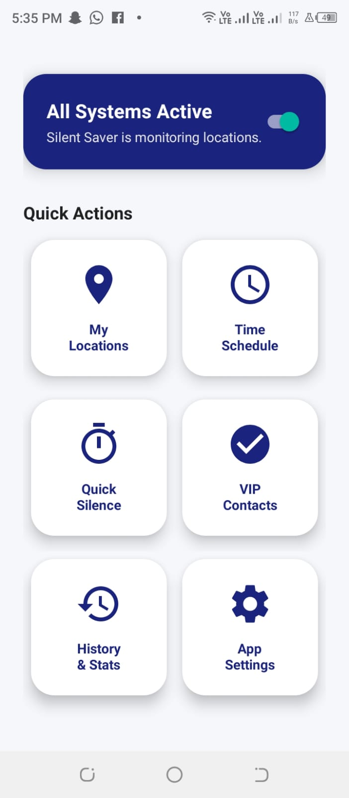
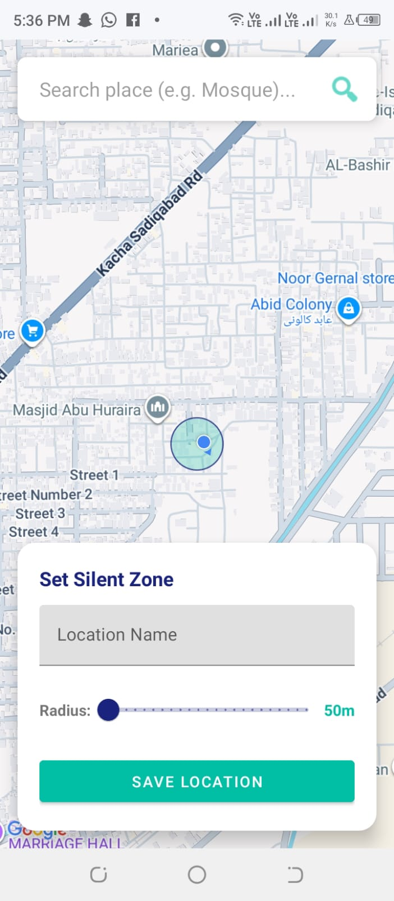
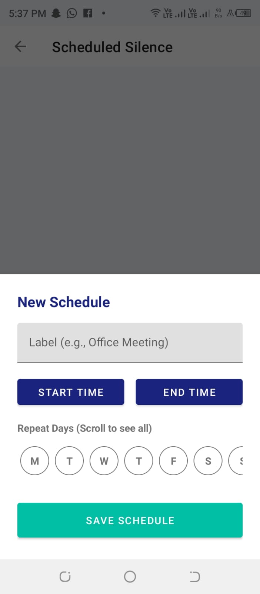

# 🔕 SilentSaver - Context-Aware Profile Manager

> A smart, automated Android application that manages your phone's ringer profiles based on **Location** and **Time**. Never disturb a meeting or prayer again, while ensuring emergency contacts can always reach you.

## 📱 Project Overview

**SilentSaver** (also known as SilentActivator) solves the binary problem of smartphone notifications: either being too loud in sensitive places or missing critical calls when silenced.

It utilizes the **Android Geofencing API** and **AlarmManager** to create a "Set it and Forget it" experience. The app automatically silences your device when you enter specific zones (Mosques, Universities, Offices) and restores volume when you leave. Additionally, a **Whitelist Override** ensures that VIP contacts (e.g., parents, spouse) can bypass silent mode during emergencies.

## ✨ Key Features

* **📍 Geofencing Automation:**
  * Automatically switches to Silent/Vibrate upon entering a zone.
  * Instantly restores Normal profile upon exit.
  * Visual Map Interface with adjustable radius (50m - 500m).

* **📅 Smart Scheduler:**
  * Set recurring silent hours (e.g., "Class: Mon, Wed @ 10:00 AM").
  * Handles overlapping schedules intelligently.

* **🛡️ Emergency Whitelist (VIP Mode):**
  * Add specific contacts to a VIP list.
  * If a VIP calls while the phone is silent, the app **overrides the system** and rings out loud at max volume.

* **⏱️ Quick Actions:**
  * **Quick Timer:** 15/30/60-minute silence for naps or ad-hoc meetings.
  * **Master Switch:** Instantly pause/resume all background monitoring.

* **🌙 Professional UI:**
  * Dark Mode support with high-contrast visibility.
  * Local History Log for transparency.

## 📸 Screenshots

| Dashboard | Add Location | Schedule |
| --- | --- | --- |
|  |  |  |

## 🛠️ Technical Stack

* **Language:** Kotlin, XML
* **Architecture:** MVVM (Model-View-ViewModel)
* **Database:** Room Persistence Library (SQLite)
* **Location:** Google Maps SDK, `GeofencingClient`
* **Background Tasks:** `BroadcastReceiver`, `AlarmManager`, `JobIntentService`
* **UI Components:** Material Design 3, `CardView`, `RecyclerView`, `ConstraintLayout`

## 📄 License
This project is licensed under the MIT License - see the [LICENSE](LICENSE) file for details.

---
**Developed by Bilal Nazeer**
